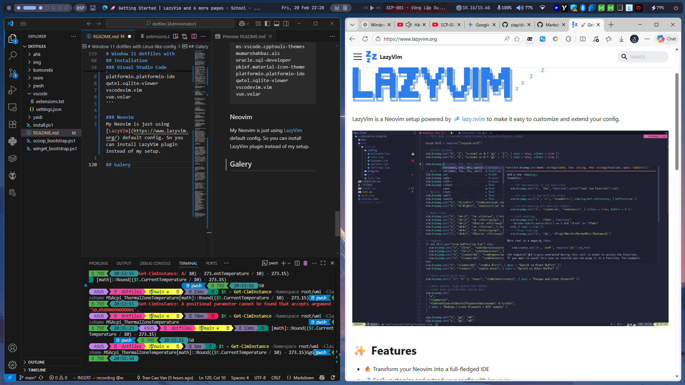
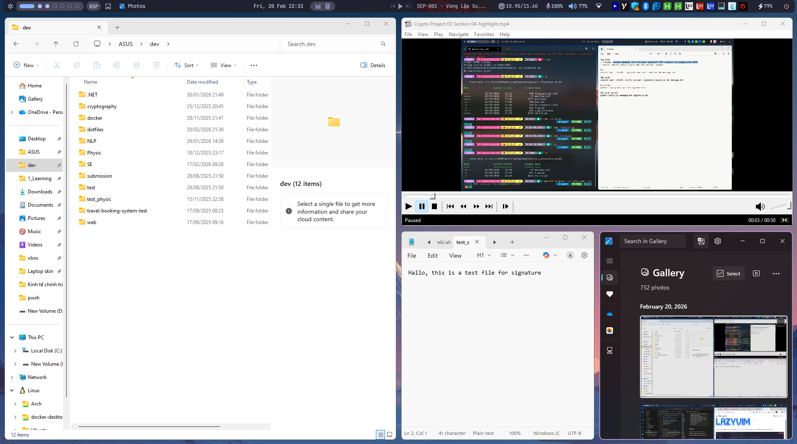
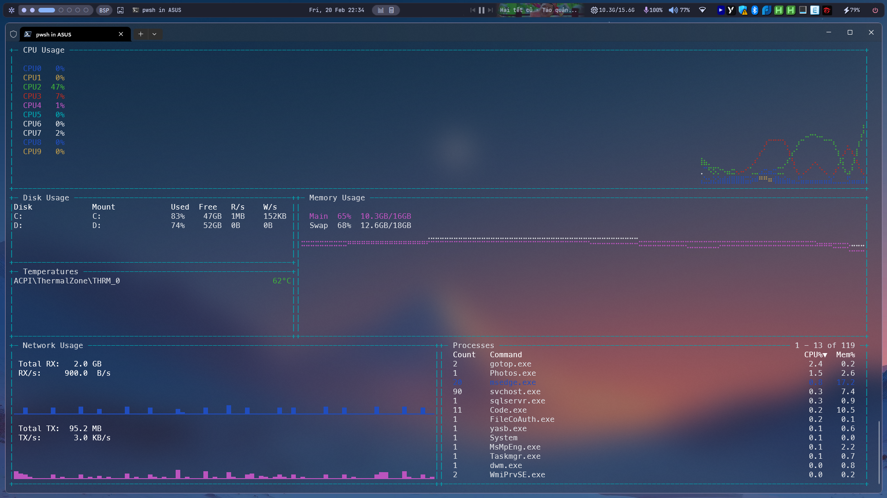

# Window 11 dotfiles with Linux-like config

This is the dotfiles of myself, being obsessed with Linux set up: Wayland, shell, vim, bars but not having the ability of using Linux. (I don't have wifi driver compatible with any Linux distro 🥲🥲). You can refered this as a Linux wayland simulator.

## Window environment and tools dependencies
These are the environment and dependencies your need to install in order to have a Linux like environment with Wayland setup. 

1. [Window 11 Home x86_64 version 22H2](https://www.microsoft.com/en-us/windows/windows-11)
2. [Komorebi](https://github.com/LGUG2Z/komorebi) version 2.0 or above
3. [YASB](https://github.com/amnweb/yasb)
4. [Neovim](https://github.com/neovim/neovim)
5. [Visual Studio Code](https://code.visualstudio.com/)
6. [Powershell](https://learn.microsoft.com/en-us/powershell/) with [Oh-My-Posh](https://ohmyposh.dev/) setup
7. [AutoHotkey](https://www.autohotkey.com/)
8. [Scoop](https://scoop.sh/) (optional but preferred)
9. [Git](https://git-scm.com/)

Install required tools through **Scoop**:

```pwsh
iwr -useb get.scoop.sh | iex
scoop install git neovim vscode oh-my-posh
```

or **Winget**:

```powershell
winget install Git.Git Neovim.Neovim Microsoft.VisualStudioCode JanDeDobbeleer.OhMyPosh AutoHotkey.AutoHotkey
```


## Installation
For a full installation, run these command in **Winget** to have all apps required:

```powershell
irm https://raw.githubusercontent.com/vantran7878/WinLin-dotfiles/main/winget_bootstrap.ps1 | iex
```

or in **Scoop**:

```powershell
irm https://raw.githubusercontent.com/vantran7878/WinLin-dotfiles/main/scoop_bootstrap.ps1 | iex
```

Then clone my setup file by symlink through this command:

```powershell
irm https://raw.githubusercontent.com/vantran7878/WinLin-dotfiles/main/install.ps1 | iex
```

If you want to clone the repository and copy files to your equivalent directory.

```powershell
git clone https://github.com/vantran7878/WinLin-dotfiles.git $HOME\dotfiles
cd $HOME\dotfiles
.\install.ps1
```

In details, this is the setup for each tools:

### Komorebi
We need a Tiling window manager in order to have the exact same felling of the Wayland (Sway, hyprland,...), in Windows, we have [Komorebi](https://github.com/LGUG2Z/komorebi). After install Komorebi, the configuration file located in `$USER$\.config\komorebi.json`.  With initial installation, komorebi also have a bar to monitor workspace, it can be edit in `$USER$\.config\komorebi.bar.json`. To run Komorebi, there's `komorebic` command:

```powershell
komorebic start
```


Initialy, Komorebi does not support remap keybinding for workspace interation or `komorebic` direct command. `Alt` is `⊞` button, every execution is similar with sway or hyprland, for detail, you should go to documentation of [Komorebi](https://github.com/LGUG2Z/komorebi). If you want to remap key binding, the AutoHotkey is required

### AutoHotkey
After installation, Autohotkey will run a `.ahk` fit the setup. My script is config as  `⊞` button, just have the file and set it run as window start. Or if you need to run it through command line it can be run as:

```powershell
komorebic start --ahk
```


> If you want to edit it yourself, you can base on my code, check the AutoHotkey document to map it with your preference.

### YASB

[YASB](https://yasb.dev/) is Yet Another Status Bar, a bar just like [Waybar](https://waybar.org/) but match with Windows OS, it have various element, using multiple style base on `yaml` structure and `css`. You can also base on my setup or edit it your self, the directory is located at `$USER$\.config\YASB\` directory

### Powershell
With powershell, this is the important part, for the themes, i use [Oh-my-posh](https://ohmyposh.dev/) with default theme. You need to create a profile pwsh script to run the code as you want `install.ps1` also do this for you to match my config or you can do it yourself.

### Visual Studio Code
My visual studio code is just extension needed for programming, after run the `install.ps1` it will automatically install extensions. The following extension is located in `vscode\extensions.txt` of my repo.

```
catppuccin.catppuccin-vsc
github.copilot
github.copilot-chat
james-yu.latex-workshop
ms-azuretools.vscode-containers
ms-dotnettools.csdevkit
ms-dotnettools.csharp
ms-dotnettools.vscode-dotnet-runtime
ms-python.debugpy
ms-python.python
ms-python.vscode-pylance
ms-python.vscode-python-envs
ms-vscode-remote.remote-containers
ms-vscode.cmake-tools
ms-vscode.cpp-devtools
ms-vscode.cpptools
ms-vscode.cpptools-extension-pack
ms-vscode.cpptools-themes
mumarshahbaz.als
oracle.sql-developer
pkief.material-icon-theme
platformio.platformio-ide
qwtel.sqlite-viewer
vscodevim.vim
vue.volar 
```

### Neovim
My Neovim is just using [LazyVim](https://www.lazyvim.org/) default config. So you can install LazyVim plugin instead of my setup.

## Galery



